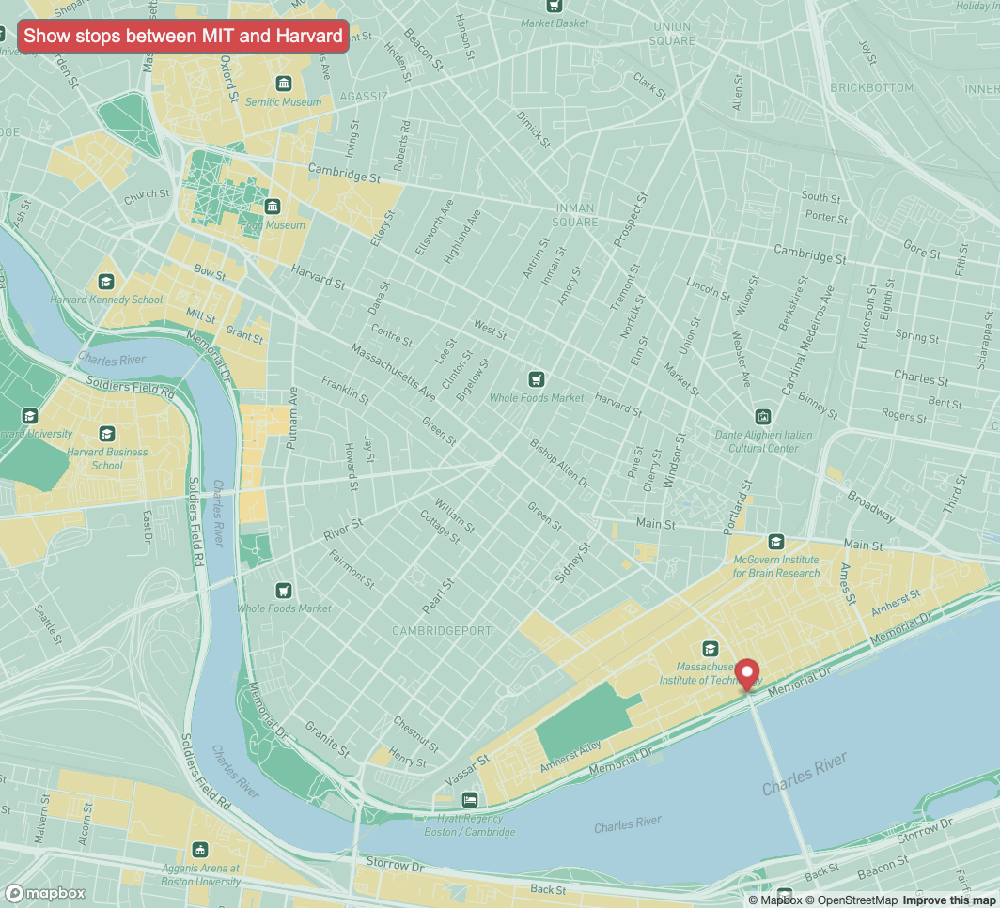

# Real Time Bus Tracker
## Show stops between MIT and Harvard

Description of the project: This project showcases a map that can also track the bus stops between MIT and Harvard in real-time when the button is clicked. I styled my own map on Mapbox by changing the background color, adding icons across the city, adding color to the green areas and highlighing the educational buildings in yellow.

How to Run: Drag and drop the index.html file into your web browser. You can use the map as normal or click on the "Show stops between MIT and Harvard" button to see the marker move from the bus stops between MIT until Harvard.

Roadmap of future improvements: I would like to change the marker to a different icon, maybe a bus. 

License information: MIT License

Copyright (c) 2022 Ella Taylor

Permission is hereby granted, free of charge, to any person obtaining a copy
of this software and associated documentation files (the "Software"), to deal
in the Software without restriction, including without limitation the rights
to use, copy, modify, merge, publish, distribute, sublicense, and/or sell
copies of the Software, and to permit persons to whom the Software is
furnished to do so, subject to the following conditions:

The above copyright notice and this permission notice shall be included in all
copies or substantial portions of the Software.

THE SOFTWARE IS PROVIDED "AS IS", WITHOUT WARRANTY OF ANY KIND, EXPRESS OR
IMPLIED, INCLUDING BUT NOT LIMITED TO THE WARRANTIES OF MERCHANTABILITY,
FITNESS FOR A PARTICULAR PURPOSE AND NONINFRINGEMENT. IN NO EVENT SHALL THE
AUTHORS OR COPYRIGHT HOLDERS BE LIABLE FOR ANY CLAIM, DAMAGES OR OTHER
LIABILITY, WHETHER IN AN ACTION OF CONTRACT, TORT OR OTHERWISE, ARISING FROM,
OUT OF OR IN CONNECTION WITH THE SOFTWARE OR THE USE OR OTHER DEALINGS IN THE
SOFTWARE.
